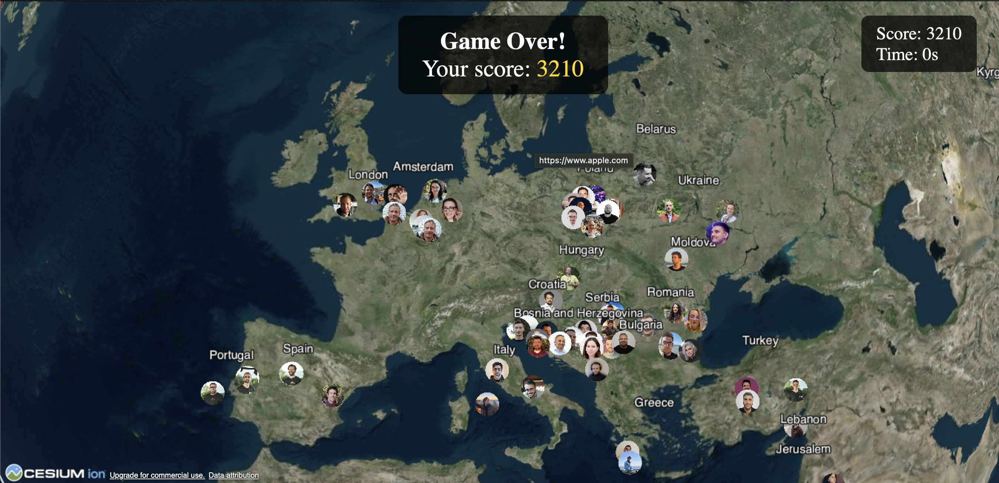

# Cesium Demo



This demo shows a world with people taken from the `people.json` and images taken from `public` folder. It's using [Cesium](https://cesium.com) for the map and rendering.


# Pre-requisited

## Create a Slack app

1. Get a Slack API Token
Create a Slack app at https://api.slack.com/apps.
2. Add the users:read and users:read.email scopes.
3. Install the app to your workspace and get the OAuth token. Copy it in the `.env` file.

Run the zscripts/read_people.py` script to generate the `public/people` images and the `people.json` file. Review the images and people to make sure there isn't any wrong/bot in the result.

```sh
pip3 install python-dotenv --break-system-packages
python3 scripts/read_people.py
```

Go through the `people.json` and add in the `countries.json` if there are any countries missing. You can use AI here, eg.:

```
Promot:
<Copy paste the people.json>

Add the countires from tz to this file, countries.json


```

How to run locally:

```sh
npm install http-server -g
http-server
```